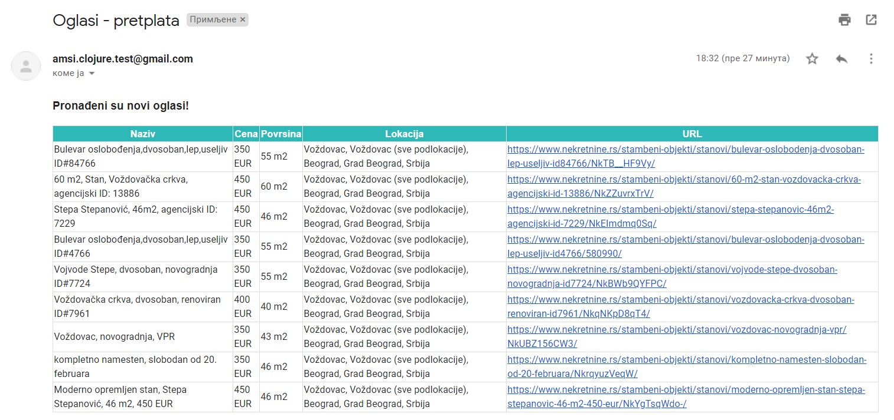

# Apartment Search

Web application built with Clojure. The goal of this project is to help in searching apartment ads. After registration and login, user can search for apartments by multiple parameters like city, location, price, area and advertiser. Also, user can subscribe to a specific search if he wants to be notified by email when new parameter-matched apartment appears.



## Getting Started

These instructions will get you a copy of the project up and running on your local machine:

+ Download and install [Leiningen](https://djpowell.github.io/leiningen-win-installer/)
+ Run MySQL
+ Import database clojure_project_db.sql
+ Clone this repo:
``` 
git clone https://github.com/programer20/clojure-project.git 
```
+ Open a terminal, navigate to project directory and run:
``` 
lein run 
```

## General Structure

There are 4 namespaces under the ``src`` folder:

+ `` web.clj ``
+ `` core.clj ``
+ `` email.clj ``
+ `` database.clj ``

The `` web.clj `` namespace contains route definitions for [Compojure](https://github.com/weavejester/compojure) and init function for [Ring](https://github.com/ring-clojure/ring). The routes are defined like this:

```
(defroutes my_routes
           (POST "/registration" [] (fn [req] (db/registration (:body req))))
           (POST "/login" [] (fn [req] (db/login (:body req))))
           (POST "/search" [] (fn [req] (core/search (:body req))))
           (POST "/subscribe" [] (fn [req] (core/subscribe (:body req))))
           (GET "/user/:id" [id] (db/get-user id))
           (GET "/subscriptions/:id" [id] (db/get-user-subscriptions id))
           (DELETE "/delete-subscription/:id" [id] (core/delete-subscription id))
           (route/resources "/"))
```

This namespace also contains several useful middleware definitions for Ring, like adding CORS headers and wrapping JSON response. Middlewares in Ring are functions that are called before or after the execution of your handlers.

The `` core.clj `` namespace uses [Enlive](https://github.com/cgrand/enlive) library for Web scraping. It also contains business logic for searching ads, filtering result and subscribing to a specific search. An example functions for Web scraping can be written like this:

```
(defn html-data
  [url]
  (-> url
   java.net.URL.
   enlive/html-resource))

(defn get-rows
  [html-data]
  (enlive/select html-data [:div.offer-body]))
```

The `` email.clj `` namespace uses [Postal](https://github.com/drewr/postal) library for constructing and sending email messages. It contains SMTP configuration and message template builder.
```
(def conn {:host "smtp.gmail.com"
           :ssl true
           :user "amsi.clojure.test@gmail.com"
           :pass (:email-password (clojure.edn/read-string (slurp "config.edn")))})
```

The `` database.clj `` namespace uses [JDBC](https://github.com/clojure/java.jdbc) to connect and interact with database.

A system use `` project.clj `` to define specific configuration and external dependencies.

## References

+ [enlive "1.1.6"]
+ [ring/ring-core "1.7.1"]
+ [ring/ring-jetty-adapter "1.7.1"]
+ [ring/ring-json "0.5.0"]
+ [ring-cors "0.1.13"]
+ [metosin/ring-http-response "0.9.0"]
+ [compojure "1.2.0-SNAPSHOT"]
+ [org.clojure/java.jdbc "0.7.11"]
+ [mysql/mysql-connector-java "5.1.25"]
+ [com.draines/postal "2.0.3"]
+ [overtone/at-at "1.2.0"]

## License

Copyright © 2019

This program and the accompanying materials are made available under the
terms of the Eclipse Public License 2.0 which is available at
http://www.eclipse.org/legal/epl-2.0.
